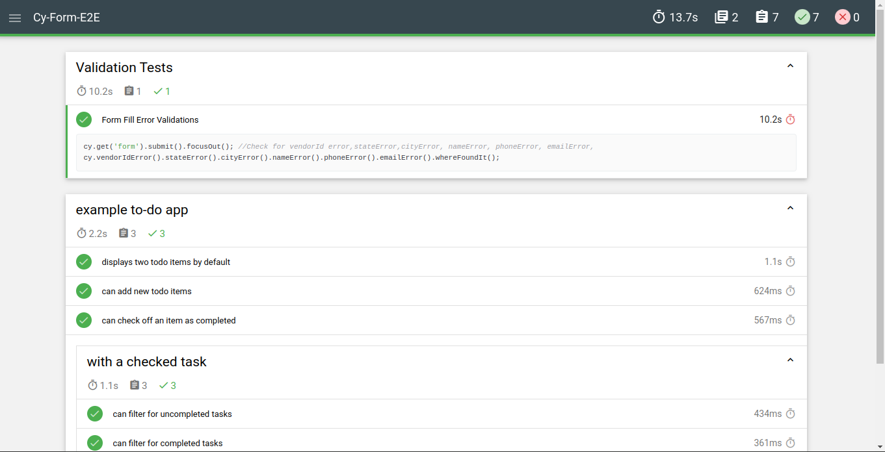
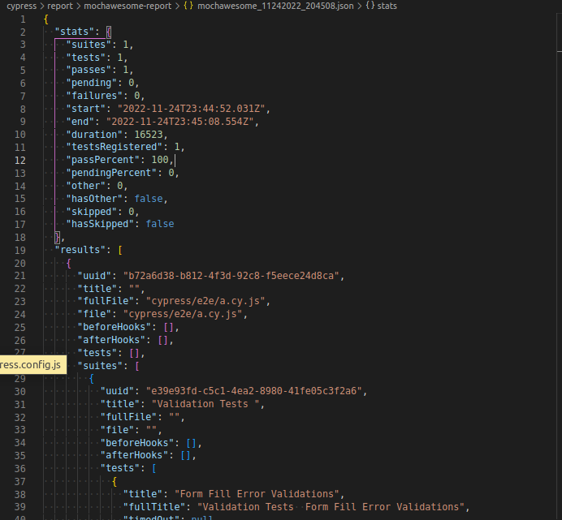
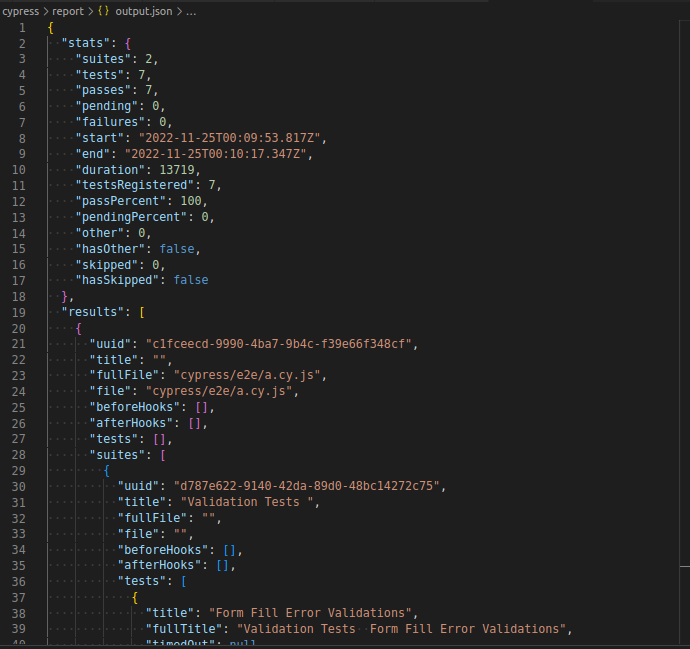

<p align="center">

  <h3 align="center">Cypress Automated Tests</h3>

  <p align="center">
    Black-Box Tests
    <br>
  </p>
</p>


## Informations

- Target : CRM forms with 100% functionality
- [Test Plan]()
- [Tests reports](#reports-generated)

## Techniques

I used:

```
Validation Tests 
Limit + Equivalence Tests
Api Tests
E2E Tests
```
Could be used:
```
White Box Tests
Security Tests
```

## Bugs and feature requests

Have a bug or a feature request? Please  search for existing and closed issues. If your problem or idea is not addressed yet, [please open a new issue](https://github.com/maNNIakk/Cy-Form-E2E/issues).

## Reports Generated
HTML Report (via mochawesome-merge)


JSON Report (via mochawesome)


JSON Merged Report (via mochawesome-merge)



Enjoy :metal: